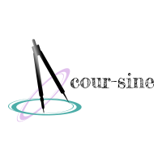

# coursine

Find the right computer or data science course for you based on your current backgrounds, interest and goals.

  

A simple Python project that utilizes the following tools or technologies.

1. Web crawling and parsing.
2. Natural language processing
3. ElasticSearch
4. Flask
5. React
6. Heroku 

Under construction:

- [x] get system to work
- [x] add docstring to functions
- [x] add a summary/workable notebook
- [ ] develop a data model for the courses
- [ ] develop an UI
- [ ] develop the search API
- [ ] migrate data to the cloud
- [ ] online

## Want to contribute?

### Contribute a course

### Bugs, feature requests, etc